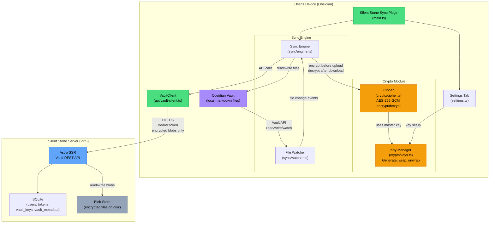

System overview showing how the Obsidian plugin connects to Silent Stone server. The plugin encrypts all data locally before upload — the server only stores encrypted blobs (zero-knowledge).

```mermaid
graph TB
    subgraph "User's Device (Obsidian)"
        Plugin["Silent Stone Sync Plugin<br/>(main.ts)"]
        Vault["Obsidian Vault<br/>(local markdown files)"]
        Settings["Settings Tab<br/>(settings.ts)"]
        VaultClient["VaultClient<br/>(api/vault-client.ts)"]

        subgraph "Crypto Module"
            Keys["Key Manager<br/>(crypto/keys.ts)<br/>Generate, wrap, unwrap"]
            Cipher["Cipher<br/>(crypto/cipher.ts)<br/>AES-256-GCM encrypt/decrypt"]
        end

        subgraph "Sync Engine"
            Engine["Sync Engine<br/>(sync/engine.ts)"]
            Watcher["File Watcher<br/>(sync/watcher.ts)"]
        end

        Plugin --> Settings
        Plugin --> Engine
        Watcher -->|"file change events"| Engine
        Vault -->|"Vault API<br/>read/write/watch"| Watcher
        Engine -->|"read/write files"| Vault
        Engine -->|"encrypt before upload<br/>decrypt after download"| Cipher
        Cipher -->|"uses master key"| Keys
        Engine -->|"API calls"| VaultClient
        Settings -->|"key setup"| Keys
    end

    subgraph "Silent Stone Server (VPS)"
        API["Astro SSR<br/>Vault REST API"]
        DB["SQLite<br/>(users, tokens,<br/>vault_keys, vault_metadata)"]
        BlobStore["Blob Store<br/>(encrypted files on disk)"]
        API --> DB
        API -->|"read/write blobs"| BlobStore
    end

    VaultClient -->|"HTTPS<br/>Bearer token<br/>encrypted blobs only"| API

    style Plugin fill:#4ade80,stroke:#16a34a,color:#000
    style API fill:#60a5fa,stroke:#2563eb,color:#000
    style Vault fill:#a78bfa,stroke:#7c3aed,color:#000
    style Keys fill:#f59e0b,stroke:#d97706,color:#000
    style Cipher fill:#f59e0b,stroke:#d97706,color:#000
    style BlobStore fill:#94a3b8,stroke:#64748b,color:#000
    style VaultClient fill:#4ade80,stroke:#16a34a,color:#000
```
