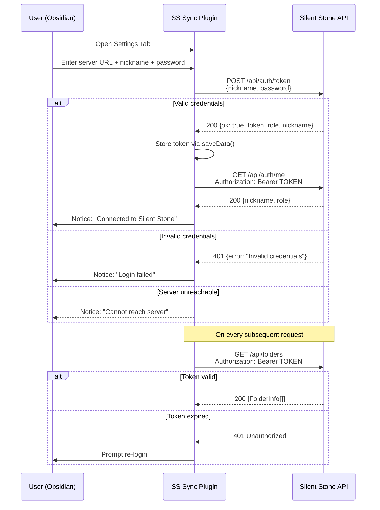

Authentication flow for the Obsidian plugin connecting to Silent Stone via Bearer token.

```mermaid
sequenceDiagram
    participant User as User (Obsidian)
    participant Plugin as SS Sync Plugin
    participant Server as Silent Stone API

    User->>Plugin: Open Settings Tab
    User->>Plugin: Enter server URL + nickname + password
    Plugin->>Server: POST /api/auth/token<br/>{nickname, password}

    alt Valid credentials
        Server-->>Plugin: 200 {ok: true, token, role, nickname}
        Plugin->>Plugin: Store token via saveData()
        Plugin->>Server: GET /api/auth/me<br/>Authorization: Bearer TOKEN
        Server-->>Plugin: 200 {nickname, role}
        Plugin->>User: Notice: "Connected to Silent Stone"
    else Invalid credentials
        Server-->>Plugin: 401 {error: "Invalid credentials"}
        Plugin->>User: Notice: "Login failed"
    else Server unreachable
        Plugin-->>User: Notice: "Cannot reach server"
    end

    Note over Plugin,Server: On every subsequent request
    Plugin->>Server: GET /api/folders<br/>Authorization: Bearer TOKEN
    alt Token valid
        Server-->>Plugin: 200 [FolderInfo[]]
    else Token expired
        Server-->>Plugin: 401 Unauthorized
        Plugin->>User: Prompt re-login
    end
```
