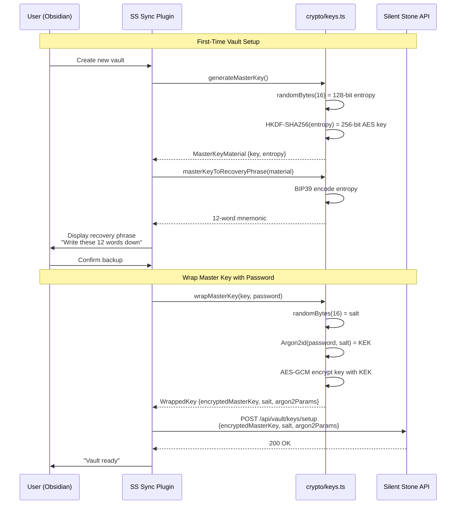
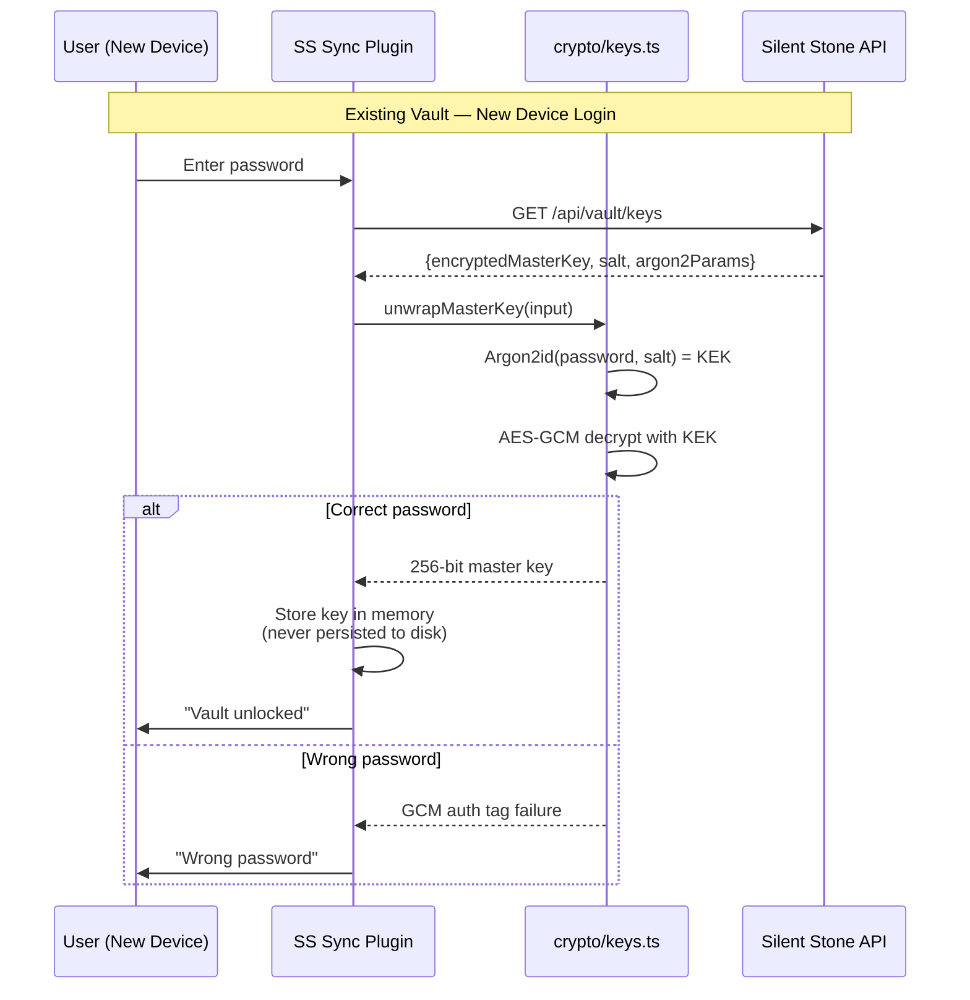
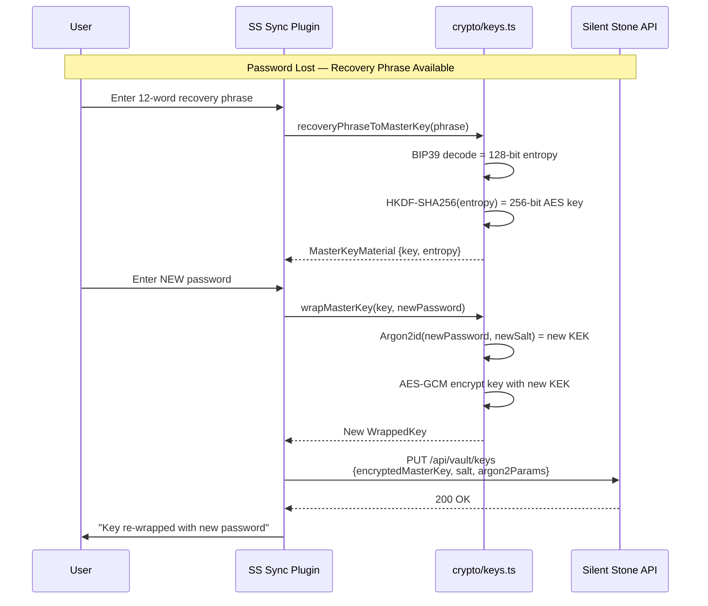
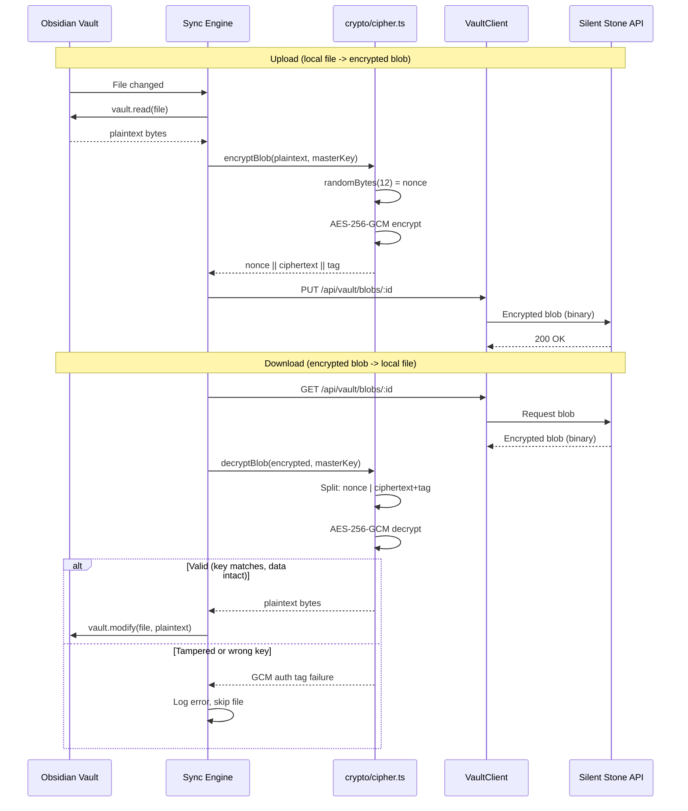
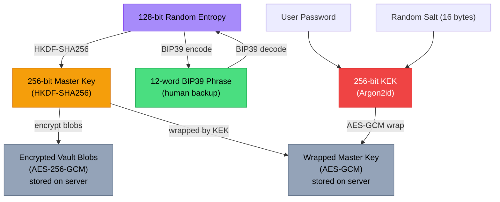

Encryption key hierarchy and blob encryption flows for the Obsidian plugin's crypto module (v0.3).

## Key Generation and Recovery

How a master key is created and backed up as a 12-word recovery phrase.

## Key Unwrap (Login on New Device)

How the master key is recovered when logging in on a different device.

## Key Recovery (Lost Password)

How the master key is recovered using the 12-word BIP39 phrase.

## Blob Encryption (Sync Operations)

How vault files are encrypted before upload and decrypted after download.

## Key Hierarchy Summary

