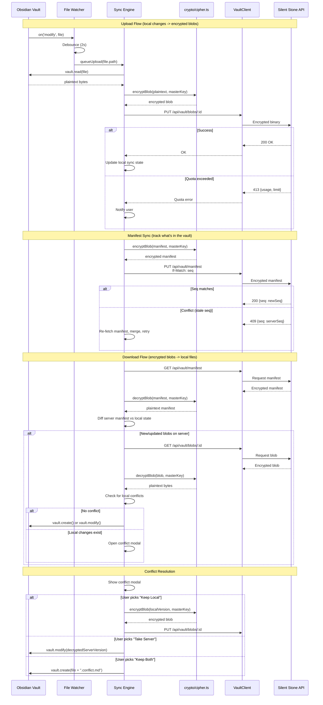

Sync cycle showing file watcher triggering encrypted uploads and periodic downloads with conflict detection. All data is encrypted client-side before leaving the device.

```mermaid
sequenceDiagram
    participant Vault as Obsidian Vault
    participant Watcher as File Watcher
    participant Engine as Sync Engine
    participant Cipher as crypto/cipher.ts
    participant Client as VaultClient
    participant Server as Silent Stone API

    Note over Vault,Server: Upload Flow (local changes -> encrypted blobs)

    Vault->>Watcher: on('modify', file)
    Watcher->>Watcher: Debounce (2s)
    Watcher->>Engine: queueUpload(file.path)
    Engine->>Vault: vault.read(file)
    Vault-->>Engine: plaintext bytes
    Engine->>Cipher: encryptBlob(plaintext, masterKey)
    Cipher-->>Engine: encrypted blob
    Engine->>Client: PUT /api/vault/blobs/:id
    Client->>Server: Encrypted binary
    alt Success
        Server-->>Client: 200 OK
        Client-->>Engine: OK
        Engine->>Engine: Update local sync state
    else Quota exceeded
        Server-->>Client: 413 {usage, limit}
        Client-->>Engine: Quota error
        Engine->>Engine: Notify user
    end

    Note over Vault,Server: Manifest Sync (track what's in the vault)

    Engine->>Cipher: encryptBlob(manifest, masterKey)
    Cipher-->>Engine: encrypted manifest
    Engine->>Client: PUT /api/vault/manifest<br/>If-Match: seq
    Client->>Server: Encrypted manifest
    alt Seq matches
        Server-->>Client: 200 {seq: newSeq}
    else Conflict (stale seq)
        Server-->>Client: 409 {seq: serverSeq}
        Engine->>Engine: Re-fetch manifest, merge, retry
    end

    Note over Vault,Server: Download Flow (encrypted blobs -> local files)

    Engine->>Client: GET /api/vault/manifest
    Client->>Server: Request manifest
    Server-->>Client: Encrypted manifest
    Engine->>Cipher: decryptBlob(manifest, masterKey)
    Cipher-->>Engine: plaintext manifest
    Engine->>Engine: Diff server manifest vs local state

    alt New/updated blobs on server
        Engine->>Client: GET /api/vault/blobs/:id
        Client->>Server: Request blob
        Server-->>Client: Encrypted blob
        Engine->>Cipher: decryptBlob(blob, masterKey)
        Cipher-->>Engine: plaintext bytes
        Engine->>Engine: Check for local conflicts
        alt No conflict
            Engine->>Vault: vault.create() or vault.modify()
        else Local changes exist
            Engine->>Engine: Open conflict modal
        end
    end

    Note over Vault,Server: Conflict Resolution

    Engine->>Engine: Show conflict modal
    alt User picks "Keep Local"
        Engine->>Cipher: encryptBlob(localVersion, masterKey)
        Cipher-->>Engine: encrypted blob
        Engine->>Client: PUT /api/vault/blobs/:id
    else User picks "Take Server"
        Engine->>Vault: vault.modify(decryptedServerVersion)
    else User picks "Keep Both"
        Engine->>Vault: vault.create(file + ".conflict.md")
    end
```
